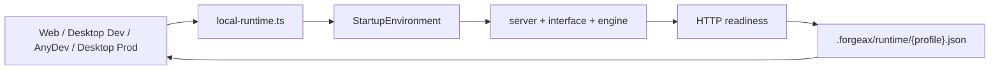

# Development & Deployment

How to run, develop, and package ForgeaX Studio — for the **web** form and the
**desktop app** (Tauri 2). Validated end-to-end from a clean clone.

## Startup profiles (one launcher)

Every local surface enters through `scripts/local-runtime.ts`. The selected
`FORGEAX_STARTUP_PROFILE` resolves resources, project storage, endpoints,
readiness, and supervision once; consumers read the resulting runtime state
instead of rebuilding those decisions.

| Profile | Surface / command | server | engine | UI origin |
|:--|:--|:-:|:-:|:--|
| **web-dev** | `bun fx start` | 18900 | 15173 | vite `:18920` |
| **desktop-dev** | `bun fx start desktop` | 18900 | 15173 | webview → vite `:18920` |
| **anydev-web** | AnyDev `init.sh` | 18900 | 15173 | gateway → vite `:80` |
| **desktop-prod** | double-click the built `.app` | **18810** | **15273** | server serves SPA single-origin |



> Desktop ports (18810/15273) are deliberately offset from the dev ports so a
> running dev stack and the `.app` never collide. Override with
> `FORGEAX_DESKTOP_SERVER_PORT` / `FORGEAX_DESKTOP_ENGINE_PORT`.

Two mode caveats worth internalizing:

- **Source edits go to the dev repo only** (`packages/*/src`, version-controlled) —
  never hand-edit inside a built `.app`. web-dev and desktop-dev pick changes up
  **live** (HMR/watch); the packaged `.app` runs a **build-time frozen copy** and
  must be **repackaged** (`bun fx build desktop`) to pick anything up.
- **desktop-dev and the `.app` are both WKWebView** → 3D rendering is bounded by
  **WebKit WebGPU** (weaker than Chrome's Dawn). Details:
  [`docs/deploy-notes.md`](./docs/deploy-notes.md) §".app 渲染: WebKit WebGPU vs 新引擎".

## Prerequisites

- **bun** ≥ 1.3, **node** ≥ 22, git, curl.
- Desktop build also needs: **Rust + cargo**, **tauri-cli 2.x** (`bunx tauri`),
  **pnpm** (the engine is a pnpm monorepo), and a wasm toolchain (the WebGPU
  module is compiled from Rust). macOS for a `.app`/`.dmg`.

## Web — run locally

```bash
bun install      # deps + prepare: engine build (pnpm + wasm) + extensions +
                   # scaffolds .env from .env.example (fill ANTHROPIC_API_KEY)
bun fx start      # server :18900 · UI :18920 · engine :15173
# open http://localhost:18920
```

`bun install` is the setup entry (root `prepare` → `scripts/prepare.ts`).
`bun fx setup` is deprecated (warns, runs `bun install`). `bun fx start`
resolves the `web-dev` profile, starts the shared launcher, and opens the
browser only after the server health endpoint, the same-origin UI health proxy,
and the engine all answer HTTP. The source service graph still runs with
`bun --watch` / `vite`, so edits in `packages/{interface,server}` take effect
immediately.

### API keys

- Chat needs **`ANTHROPIC_API_KEY`** in `$ROOT/.env` (web) — set it via
  editing `.env` (scaffolded by prepare). `ANTHROPIC_BASE_URL` is optional
  (proxy; blank = api.anthropic.com).
- **The services boot without a key** — `/api/settings`, the SPA, and the engine
  preview all work keyless. Only LLM chat requires the key.
- In the desktop app, the key lives in `~/ForgeaxProjects/.env`; a **first-run
  overlay** prompts for it the first time you open the app and writes it there
  (applied live, no restart).

## Desktop — one command (recommended)

```bash
bun fx start desktop          # dev app: native window + live source (HMR). First run auto-installs;
                     # auto-starts the web stack; auto-stops it when you close the window.
bun fx build desktop    # package a distributable .app / .dmg
bun scripts/desktop.ts open     # open the last-built .app
bun fx stop     # stop the dev web stack
```

`bun fx start desktop` is the supported desktop-dev entry. It resolves and
verifies the `desktop-dev` profile, then injects that profile's `devUrl` into
Tauri; direct `tauri dev` intentionally has no authoritative startup
environment.

## Desktop — build the `.app` / `.dmg`

```bash
bun fx build desktop          # assemble Resources + compile and bundle Tauri
# → packages/interface/src-tauri/target/release/bundle/macos/ForgeaX Studio.app
#   (and …/bundle/dmg/…dmg)
```

The `.app` is self-contained. Tauri starts one bundled `local-runtime` process;
that launcher prepares `~/ForgeaxProjects`, starts and supervises server +
engine on 18810/15273, writes the same runtime-state contract, and marks ready
only after all HTTP probes pass. Tauri then loads the single-origin SPA. Launch
it with `open "…/ForgeaX Studio.app"`.

## Build to a runnable monorepo snapshot (optional)

`scripts/build.sh release-source` assembles a flat source snapshot under
`packages/build/output/` (used for release mirroring).

## Troubleshooting (from real runs)

| Symptom | Cause / fix |
|---|---|
| `cp: …/node_modules/*: No such file or directory` during desktop assembly | The desktop assemble needs a **hoisted** root `node_modules`; bun's default isolated linker leaves it empty. `scripts/build-desktop.ts` now self-heals with `bun install --linker hoisted` (step 0). If you hit this on an old script, run `bun install --linker hoisted` at the repo root first. |
| `bundle_dmg.sh` fails / no `.dmg` (but the `.app` exists) | The DMG styling step uses Finder/AppleScript and fails in a headless session. **The `.app` itself is fine** — use it directly, or produce the dmg from a GUI session (or via `hdiutil`). |
| Engine preview is blank / `Failed to resolve @forgeax/engine-*` | The engine isn't built. Run `bun install` (prepare does `pnpm install` + builds the engine packages incl. the wasm module). |
| `engine dist STALE` on start (after an engine bump) | `bun fx start` blocks with the fix: `bun run prepare` then `bun fx start`. For unattended/agent starts, `FORGEAX_AUTO_DEPLOY=1 bun fx start` rebuilds automatically instead of blocking. |
| `ERR_SSL_PROTOCOL_ERROR` on `:18920` | The interface defaults to HTTPS when `FORGEAX_INTERFACE_HTTPS=1`. Either access via `https://`, or run plain HTTP on `localhost` (WebGPU still works on localhost). |
| Port already in use | `bun fx stop` (SIGTERM + grace) then `bun fx start`. The `.app`'s launcher reaps 18810/15273 when the app quits. |
| Chat says "no API key" | Set `ANTHROPIC_API_KEY` in `.env` (web) or via the desktop first-run overlay. |
