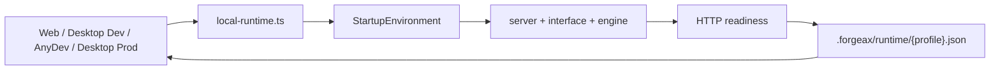

# Development & Deployment

How to run, develop, and package ForgeaX Studio — for the **web** form and the
**desktop app** (Tauri 2). Validated end-to-end from a clean clone.

## Startup profiles (one launcher)

Every local surface enters through `scripts/local-runtime.ts`. The selected
`FORGEAX_STARTUP_PROFILE` resolves resources, project storage, endpoints,
readiness, and supervision once; consumers read the resulting runtime state
instead of rebuilding those decisions.

| Profile | Surface / command | server | engine | UI origin |
|:--|:--|:-:|:-:|:--|
| **web-dev** | `bun fx start` | 18900 | 15173 | vite `:18920` |
| **desktop-dev** | `bun fx start desktop` | 18900 | 15173 | webview → vite `:18920` |
| **anydev-web** | AnyDev `init.sh` | 18900 | 15173 | gateway → vite `:80` |
| **desktop-prod** | double-click the built `.app` | **18810** | **15273** | server serves SPA single-origin |


```mermaid
flowchart LR
    S["Web / Desktop Dev / AnyDev / Desktop Prod"] --> L["local-runtime.ts"]
    L --> C["StartupEnvironment"]
    C --> R["server + interface + engine"]
    R --> H["HTTP readiness"]
    H --> J[".forgeax/runtime/{profile}.json"]
    J --> S
```

> Desktop ports (18810/15273) are deliberately offset from the dev ports so a
> running dev stack and the `.app` never collide. Override with
> `FORGEAX_DESKTOP_SERVER_PORT` / `FORGEAX_DESKTOP_ENGINE_PORT`.

Two mode caveats worth internalizing:

- **Source edits go to the dev repo only** (`packages/*/src`, version-controlled) —
  never hand-edit inside a built `.app`. web-dev and desktop-dev pick changes up
  **live** (HMR/watch); the packaged `.app` runs a **build-time frozen copy** and
  must be **repackaged** (`bun fx build desktop`) to pick anything up.
- **desktop-dev and the `.app` are both WKWebView** → 3D rendering is bounded by
  **WebKit WebGPU** (weaker than Chrome's Dawn). Details:
  [`.forgeax-harness/docs/deploy-notes.md`](./.forgeax-harness/docs/deploy-notes.md) §".app 渲染: WebKit WebGPU vs 新引擎".

## Prerequisites

- **bun** ≥ 1.3, **node** ≥ 22, git, curl.
- Desktop build also needs: **Rust + cargo**, **tauri-cli 2.x** (`bunx tauri`),
  **pnpm** (the engine is a pnpm monorepo), and a wasm toolchain (the WebGPU
  module is compiled from Rust). macOS for a `.app`/`.dmg`.

## Worktree — isolated local runtime

一个物理 Git worktree 对应一个 RuntimeInstance：一个 config、一个 id、一个
slot。`RuntimeInstance` 是端口、project root、runtime state/log、socket 与可选
user root 的唯一执行真源；本文只描述流程，不能替代 `bun fx instance show` 的
实际输出。

```bash
# 1. 一键创建完整 worktree；不要在主 checkout 切分支。
bun fx worktree my-change --isolate-user --env-file /path/to/local.env
cd .worktrees/my-change

# 2. 上一条命令已经完成 recursive submodule、浮动仓、依赖、prepare 和 slot 分配。
#    如果创建时传了 --no-setup / --fast，才需要手动补完整 prepare：
# bun fx setup

# 3. 查看命令自动分配的 RuntimeInstance；也可以创建时传 --slot N 固定它。
bun fx instance show

# 4. 日常生命周期。
bun fx start
bun fx status
bun fx open
bun fx stop
```

`bun fx worktree <name>` 默认创建 `codex/<name>` branch 到 `.worktrees/<name>`，并优先
从当前 checkout 本地 clone 各种浮动仓，以避免重复网络拉取；缺失的浮动仓才走 origin
初始化。`--no-setup`（别名 `--fast`）保留 submodule、浮动仓、依赖和 RuntimeInstance，
只跳过安装后的重型 prepare。

slot `0` 保留为未配置 checkout 的兼容默认值；并行 worktree 应从 `1..4` 选择。
同一 slot 会派生相同的 OS 监听端口，因此即使是不同 worktree 也会冲突，必须分配
不同 slot。派生规则是每个 slot 相对基础端口带加 `10,000` 的偏移；完整的当前端口、
origin、路径和实例 id 请以 `bun fx instance show` 为准，而不要复制或手改端口表。

`--isolate-user` 会将用户数据 root 也放在该 worktree 的 `.forgeax/user`。无论是否
隔离用户，`.forgeax`、`node_modules`、project/state/log 都必须是各 worktree 自己的
目录；agent-host socket 则由 instance server port 派生为短 user-local 路径，按 slot
隔离，以避开 macOS Unix socket 的路径长度限制。`--env-file` 只在 config 中保存 env
文件的**路径**，不会复制或打印 secret；请把该文件置于各自安全的位置。

不要裸起 Vite，也不要手写 `FORGEAX_*` 端口变量来拼另一套运行时。旧的
`scripts/dev-local.ts` / `scripts/dev-local2.ts` 只保留为 deprecated 兼容入口：它们在
无 config 时分别安全初始化 slot 1 / 2，已有不同 slot 时拒绝覆盖；迁移后直接使用
`bun fx instance` 与 `bun fx start`。

`bun fx stop` 只会处理当前 instance state 能证明归属的进程和资源；归属无法证明时会
fail closed。遇到 stale lock，不要删除 state 或猜测 PID：运行 `bun fx stop`，让它通过
cleanup lease 恢复可验证的状态后再启动。

## Web — run locally

```bash
bun install      # deps + prepare: engine build (pnpm + wasm) + extensions +
                   # scaffolds .env from .env.example (fill ANTHROPIC_API_KEY)
bun fx start      # server :18900 · UI :18920 · engine :15173
# open http://localhost:18920
```

`bun install` is the setup entry (root `prepare` → `scripts/prepare.ts`).
`bun fx setup` is deprecated (warns, runs `bun install`). `bun fx start`
resolves the `web-dev` profile, starts the shared launcher, and opens the
browser only after the server health endpoint, the same-origin UI health proxy,
and the engine all answer HTTP. The source service graph still runs with
`bun --watch` / `vite`, so edits in `packages/{interface,server}` take effect
immediately.

### Optional headless screenshot renderer

The setup step also provisions the Chromium and Chromium headless-shell
binaries required by the `3d-lowpoly` and `scene-generator` screenshot
renderers. If the default Playwright CDN is unreachable, set
`PLAYWRIGHT_DOWNLOAD_HOST` (or `PLAYWRIGHT_CHROMIUM_DOWNLOAD_HOST`) to an
internal artifact mirror and rerun `bun fx setup`. When the browser download is
unavailable, the core Studio stack still starts and logs that the optional
renderer was skipped.

### API keys

- Chat needs **`ANTHROPIC_API_KEY`** in `$ROOT/.env` (web) — set it via
  editing `.env` (scaffolded by prepare). `ANTHROPIC_BASE_URL` is optional
  (proxy; blank = api.anthropic.com).
- **The services boot without a key** — `/api/settings`, the SPA, and the engine
  preview all work keyless. Only LLM chat requires the key.
- In the desktop app, the key lives in `~/ForgeaxProjects/.env`; a **first-run
  overlay** prompts for it the first time you open the app and writes it there
  (applied live, no restart).

## Desktop — one command (recommended)

```bash
bun fx packages ensure --only ide  # materialize the independent forgeax-ide mount when needed
bun fx start desktop               # native Tauri window + live source (HMR)
bun fx build desktop               # package a distributable .app / .dmg
open "packages/ide/src-tauri/target/release/bundle/macos/ForgeaX Studio.app"  # macOS
bun fx stop                        # stop the dev web stack
```

`bun fx start desktop` is the supported desktop-dev entry. It resolves the
`desktop-dev` profile and its `devUrl`, then runs the mounted IDE's
`dev:desktop` script. That script starts Tauri with `src-tauri/tauri.dev.conf.json`;
Tauri's `beforeDevCommand` runs `bun ../../scripts/tauri-dev-services.ts`, which
starts the source runtime and waits for readiness for the window lifetime. Direct
`tauri dev` skips the Studio wrapper and does not provide the complete startup environment.

## Desktop — build the `.app` / `.dmg`

```bash
bun fx build desktop  # assemble resources, compile the Tauri shell, and bundle
# local default target:
# → packages/ide/src-tauri/target/release/bundle/macos/ForgeaX Studio.app
# → packages/ide/src-tauri/target/release/bundle/dmg/*.dmg
# an explicit target uses packages/ide/src-tauri/target/<target-triple>/release/bundle/
```

> [!IMPORTANT]
> Use the Bun version declared in `.bun-version` and install Node, Rust/Cargo,
> and Xcode Command Line Tools. Private source inputs require normal Git access
> to the selected repositories. Do not replace release pins with main heads or
> borrow another checkout's compiled output to make installation pass.

The local packaging entry currently supports macOS arm64/x64; Windows and Linux
are not covered by this entry. It builds CLI, Orchestrator and the private Server
from the selected source, assembles and validates resources, bundles Tauri, then
finalizes and verifies the App and DMG. It does not publish or launch the App.

Each invocation prints an independent output directory under
`.forgeax/local-packages/local-<timestamp>-<pid>/`. The directory contains stage
logs and `steps.json`; the artifacts are under
`target/<rust-target>/release/bundle/macos/ForgeaX Studio.app` and `bundle/dmg/`.
A failed stage stops the build; inspect its log before retrying.

For an existing release checkout, `bun fx update` fast-forwards its configured
upstream and prepares the selected inputs. A branch without an upstream is an
error, not permission to rebase onto main. `bun install --frozen-lockfile` is
still required after source updates. `bun fx start desktop` is development mode,
not package verification.

The `.app` is self-contained. Tauri starts one bundled `local-runtime` process;
that launcher prepares `~/ForgeaxProjects`, starts and supervises server +
engine on 18810/15273, writes its desktop runtime state, and reports ready only
after all HTTP probes pass. Tauri then loads the single-origin SPA. Launch
it with the macOS `open` command shown above. Windows and Linux installers are
under `packages/ide/src-tauri/target/release/bundle/` by default, or under
`packages/ide/src-tauri/target/<target-triple>/release/bundle/` when a target is specified.

## Desktop smoke checks and their boundary

The IDE owns two browser-based smoke checks. They are useful public reproductions
from the Studio root after `packages/ide` is mounted, but they do not launch a
native Tauri window or claim to validate the platform WebView.

`desktop-dev` runs source code through Vite and does not consume the final
bundle, bundled resources, or sidecar process. Use the assembled-runtime smoke
or a packaged-app test when the suspected failure involves those production-only
inputs, their filesystem permissions, or their startup lifecycle.

| Check | Command | Covers | Does not cover |
|:--|:--|:--|:--|
| Static production bundle | `bun run --cwd packages/ide build:web`<br>`bun run --cwd packages/ide smoke:production-bundle` | Serves `packages/ide/dist` from a loopback HTTP server, opens it in Chromium, and checks that the SPA root mounts without page errors. | Tauri, bundled resources, `local-runtime`, server/engine processes, and native WebView behavior. |
| Assembled desktop runtime | `bun run --cwd packages/ide prepare:desktop`<br>`bun run --cwd packages/ide smoke:desktop-runtime` | Starts the assembled Bun runtime/guardian from `packages/ide/src-tauri/resources`, checks runtime state/readiness, binds a fixture project, probes its asset catalog, and drives the preview in Chromium. | Rust/Tauri compilation, installer metadata, and native WebView behavior. |

Both smokes need a Chromium-compatible browser: macOS uses the standard Chrome
path unless `IDE_BROWSER_EXECUTABLE` is set, Linux CI provisions Playwright
Chromium, and Windows uses the installed Edge channel unless that variable is
set.

`prepare:desktop` also checks the Studio revision recorded by
`packages/ide/product/integration-inputs.json`; run it from a Studio checkout
matching that revision when the IDE mount is pinned to a different integration
commit.

`bun fx build desktop` runs the IDE's `build:desktop` script; its Tauri
`beforeBuildCommand` invokes `prepare:desktop`. Run the two smoke commands
separately when you need to distinguish static frontend failures from bundled
runtime failures.

## Build to a runnable monorepo snapshot (optional)

`scripts/build.sh release-source` assembles a flat source snapshot under
`packages/build/output/` (used for release mirroring).

## Build the Game Runtime npm release train

Game Runtime is a separate five-package release surface owned by Studio:

```text
@forgeax/game-runtime-common
@forgeax/game-runtime-darwin-arm64
@forgeax/game-runtime-win32-x64
@forgeax/game-runtime-linux-x64
@forgeax/game-runtime
```

All five currently share version `0.3.33`. Native archives must be produced on their
matching GitHub runner; Linux x64 means glibc. The release workflow installs the
pinned Engine pnpm graph, builds the Engine SDK into Common, builds/scans native
packages on macOS/Windows/Linux, validates one five-package release train, then
publishes Common → platform packages → Universal. `@forgeax/game` is released from
its own repository only after Universal `0.3.33` is visible in npm.

For local structural verification, use the Runtime commands in
[`.forgeax-harness/docs/testing.md`](./.forgeax-harness/docs/testing.md). Do not infer Windows/Linux native readiness
from a local Darwin run, and do not hand-create a registry lock before the packages
exist.

## Troubleshooting (from real runs)

| Symptom | Cause / fix |
|---|---|
| Desktop resources are missing during a smoke or build | Run `bun run --cwd packages/ide prepare:desktop`; `bun fx build desktop` runs the same preparation through Tauri's `beforeBuildCommand`. |
| Missing workspace dependencies during desktop assembly | Run the selected checkout's `bun install --frozen-lockfile` and inspect preparation errors. Do not use another checkout's dependencies or switch linker modes to hide a lock mismatch. |
| `bundle_dmg.sh` fails / no `.dmg` (but the `.app` exists) | The DMG styling step uses Finder/AppleScript and fails in a headless session. **The `.app` itself is fine** — use it directly, or produce the dmg from a GUI session (or via `hdiutil`). |
| Engine preview is blank / `Failed to resolve @forgeax/engine-*` | The engine isn't built. Run `bun install` (prepare does `pnpm install` + builds the engine packages incl. the wasm module). |
| `engine dist STALE` on start (after an engine bump) | `bun fx start` blocks with the fix: `bun run prepare` then `bun fx start`. For unattended/agent starts, `FORGEAX_AUTO_DEPLOY=1 bun fx start` rebuilds automatically instead of blocking. |
| `ERR_SSL_PROTOCOL_ERROR` on `:18920` | The interface defaults to HTTPS when `FORGEAX_INTERFACE_HTTPS=1`. Either access via `https://`, or run plain HTTP on `localhost` (WebGPU still works on localhost). |
| Port already in use | `bun fx stop` (SIGTERM + grace) then `bun fx start`. The `.app`'s launcher reaps 18810/15273 when the app quits. |
| Chat says "no API key" | Set `ANTHROPIC_API_KEY` in `.env` (web) or via the desktop first-run overlay. |
