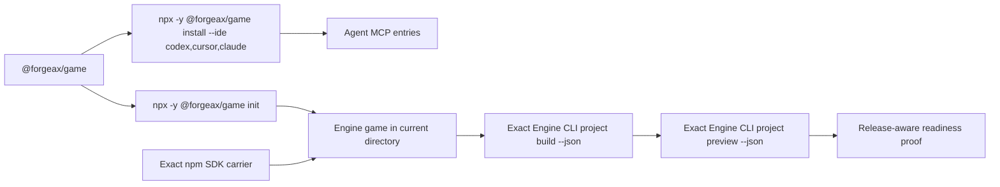

# `@forgeax/game`

[](https://www.npmjs.com/package/@forgeax/game)
[](./package.json)
[](https://modelcontextprotocol.io/)

Two-command MCP/CLI onboarding for ForgeaX Engine games. The Game Plugin delegates
creation, build, and Preview to the exact Engine SDK instead of carrying a second
runtime.

> [!IMPORTANT]
> The package carries `forgeax-game` and scoped `game` binary aliases and resolves the exact
> `@forgeax/engine-sdk@0.3.3` and `pnpm@11.7.0` dependencies. It has no
> `@forgeax/game-runtime` dependency and no static Preview fallback.

## Supported flow



`install` verifies the unbound package identity before changing any Agent config.
`init` creates the default empty game in a genuinely blank current directory through
the exact Engine carrier, then binds routing and host skills. The connector never asks
users to download an SDK, unpack a carrier, run a third Engine command, or set a
mutable SDK path/environment override.

## Two-command onboarding

Requirements: Node.js `>=22.13.0` and a genuinely blank target directory for `init`.
The exact package and Engine carrier are resolved by npm and the Game Plugin.

```bash
npx -y @forgeax/game install --ide codex,cursor,claude
cd ./empty-game-directory
npx -y @forgeax/game init
```

The first command writes the `forgeax` MCP member in the canonical Codex,
Cursor, and the reference agent CLI user configs. It preserves unrelated bytes and values,
reports `CURRENT` on an idempotent rerun, and says which host must restart or reload.
The second command must run from the intended blank directory. It creates the Engine
game there, binds the exact release identity, and reports the canonical root and
host-skill result. Existing exact games are read back and bound without recreation;
unknown non-empty directories fail closed.

Check the package being executed, or refresh an existing project's configured hosts:

```bash
npx -y @forgeax/game@latest version
npx -y @forgeax/game@latest update --ide codex
```

`update` reports the configured transition, for example
`plugin 0.3.4 -> 0.3.5`. It refreshes configuration, skills, and routing from the
package being executed; it does not independently fetch another package.

This version consumes the exact Engine SDK pin in package.json; it does not migrate game dependencies.
For projects created with Engine 0.2.1, follow the
[Engine 0.2.1 to 0.3.3 game dependency migration guide](docs/engine-0.2.1-to-0.3.3-migration.md)
before rebinding them with `init`.

> [!NOTE]
> Asset3D is optional and disabled by default. After init, run
> `npx -y @forgeax/game asset3d enable`. It directly validates the selected
> service and stores credentials outside the project. See [Asset3D](docs/asset3d.md).

## Agent completion contract

`init` records `.forgeax/game-authoring-baseline.json` before gameplay authoring. An
untouched Empty template remains runnable. After making a game, replace the Empty
identity and README, document controls, and test a real gameplay rule rather than
renaming the template test. The connector checks completion evidence before Preview.
Authoring layout follows the installed Engine and
`forge.json` (Engine 0.3.3 uses `assets/` Packs and `roots`); the Studio-hosted
`.forgeax/games/<slug>` layout is never created by this package.

Every supported host receives the same packaged `forgeax-game` Skill and routing rule.
They require UI to mount under the Engine Host `uiRoot` or `#game-ui`. The released
standalone Host provides `#game-ui`; direct `document.body` mutation is rejected.
Preview `ready` verifies startup and ownership, not playable behavior. Agents use
available browser tools for task-relevant interaction checks, or clearly report
gameplay as unverified and provide manual checks. This guidance does not prescribe
a game genre, UI implementation, browser brand, or additional blocking gate.
An explicit request for an existing/library 3D asset uses the enabled project's
`asset3d candidates` and `asset3d import` CLI commands. No separate Agent MCP tool
is required. Report CLI failures rather than relabeling procedural geometry or
generation as an asset-library result. See the [Skill + CLI integration standard](docs/plugin-integration-standard.md).

## MCP transports

Local Agent clients should use the default stdio transport installed by
`forgeax-game install`. For a shared local daemon, bind only to loopback:

```bash
forgeax-game mcp --transport http --host 127.0.0.1 --port 18940 --root "$PWD"
```

The Streamable HTTP endpoint is `http://127.0.0.1:18940/mcp`. A non-loopback
listener requires `FORGEAX_REMOTE_MCP_TOKEN`; `--require-auth` also enforces bearer
authentication on loopback. HTTP mode adds bounded game-file tools under the fixed
root and never accepts a caller-provided `target_dir`.

## MCP surface

| Surface | Kind | Contract |
|:--|:--|:--|
| `forgeax://status` | Resource | Read-only game, Engine release, DevKit, and Preview identity |
| `forgeax_status_lite` | Tool | Resource fallback for clients without MCP resource support |
| `forgeax_run_current_game` | Tool | Exact Engine build followed by start/reuse of Engine-owned Preview |
| `forgeax_generate_image` | Tool | Existing image-generation helper; outside the G0 Preview cutover |
| `forgeax_generate_3d` | Tool | Generation fallback used only for misses after the Asset3D search lifecycle |
| `forgeax_game_list_files` | HTTP tool | List non-hidden files below the selected game |
| `forgeax_game_read_file` | HTTP tool | Read one UTF-8 game file and return its SHA-256 |
| `forgeax_game_read_logs` | HTTP tool | Read a bounded Preview log tail for remote diagnosis |
| `forgeax_game_write_file` | HTTP tool | Atomically create or hash-guard replacement of a text file |

The build plus Preview-readiness deadline is 150 seconds. Engine 0.3.3 emits
structured `project build` and `project preview` envelopes. Where authenticated
`GET /.forgeax/preview-health` is available, it must echo the canonical root,
exact release, build digest, and instance ID; the connector also checks the
served build artifact against the build it just produced.

Any build or Preview failure is an MCP `isError` result. Agents must not probe or
reuse an existing localhost port after a failed call: HTTP 200 is not ownership
evidence. Only a successful result containing `preview.status: ready`, `preview_url`,
`preview.root`, `preview.build_digest`, and `preview.instance_id` authorizes a Preview
claim. If another game owns the Engine port, stop that game explicitly or report the
blocker; never substitute its URL.

## Preview ownership

Per game, connector-owned state lives at:

```text
<project>/.forgeax/run/engine-preview/<sha256(canonical-game-root)>/
├── lock
├── state.json
├── stdout.log
└── stderr.log
```

The directory is `0700`; files are `0600`; logs rotate at 8 MiB and keep two prior
files. Reuse requires the build/Engine/instance identity, unchanged process-start
identity, and either authenticated health or the exact served dist digest after MCP
restart. PID alone never authorizes a signal.

```bash
forgeax-game preview stop --target-dir ./my-game
forgeax-game preview stop --target-dir ./my-game --json
```

Stop and cancellation signal only the verified owning Preview process, with a bounded
TERM/KILL cleanup. Dead state is removed under the lock; a matching orphan is adopted;
a live unverifiable PID fails closed as `preview_ownership_unverified`.

## Asset3D: Skill + CLI

The installed `art-3d-asset-library` Skill guides candidate selection and result use.
The package CLI calls the asset API directly, safely downloads Pack/GLB sources,
and delegates import/build/catalog identity to Engine. There is no Asset3D MCP,
Python Provider, per-platform bundle or legacy Skill payload.

See [usage and configuration](docs/asset3d.md) and the
[capability authoring template](docs/plugin-integration-standard.md).

## Scope boundary

> [!WARNING]
> G0/A0 packed and controlled-fixture evidence is supporting evidence only. It does
> not prove Studio, Editor, RuntimeInstance, host permission parity, visible Play, or
> real EA/provider access. Those remain separate downstream integration and terminal
> acceptance gates.

See [docs/runtime.md](docs/runtime.md) for the exact artifact and lifecycle contract.
For current asset configuration and the breaking simplification, see [Asset3D](docs/asset3d.md).
